rangemap: Simple Tools for Defining Species Ranges
================
Marlon E. Cobos, Vijay Barve, Narayani Barve, and Alberto
Jimenez-Valverde

  - [Project description](#project-description)
      - [Status of the project](#status-of-the-project)
  - [Package description](#package-description)
  - [Installing the package](#installing-the-package)
  - [Using the package functions](#using-the-package-functions)
      - [Preparing R](#preparing-r)
      - [Simple graphical exploration of your
        data.](#simple-graphical-exploration-of-your-data.)
      - [Species ranges from buffered
        occurrences](#species-ranges-from-buffered-occurrences)
      - [Species ranges from
        boundaries](#species-ranges-from-boundaries)
      - [Species ranges from hull
        polygons](#species-ranges-from-hull-polygons)
      - [Species ranges from ecological niche models
        results](#species-ranges-from-ecological-niche-models-results)
      - [Species ranges using trend surface
        analyses](#species-ranges-using-trend-surface-analyses)
      - [Nice figures of species
        ranges](#nice-figures-of-species-ranges)
      - [Species ranges and environmental
        factors](#species-ranges-and-environmental-factors)

<hr>

**This repository is for the GSoC 2018 project “Species range maps in
R”.**

## Project description

Student: *Marlon E. Cobos*

Mentors: *Narayani Barve, Vijay Barve, and Alberto Jimenez Valverde*

The species range maps project is motivated by the importance of
information about species distribution for processes of conservation
planning and the study of spatial patterns of biodiversity. In the face
of multiple threats related to Global Change, protection and mitigation
actions are crucial for maintaining the health of the planet, and
knowing where species are located constitutes in primary information for
starting these efforts. Currently, generation of species ranges maps may
take several steps and the use of specialized software. Thanks to the
recent development of specialized packages, R is rapidly becoming an
excellent alternative for analyzing the spatial patterns of
biodiversity. Taking advantage of these packages and the versatility of
R, the aim of this project was offering handily and robust open source
tools to obtain reliable proposals of species distribution ranges and to
analyze their geographical patterns. A large community of students,
researchers, and conservation managers can be benefited by this project
since these tools will be freely available and will improve the way in
which studies of species distributions are developed.

### Status of the project

At the moment we have completed all the proposed tasks. Some of the
planned functions were not developed since other packages have similar
functionalities. Instead, we created other functions not considered
initially but that complement this package with useful options for
visualization. Next steps include massive testing of this package
functions and submitting it to CRAN.

All commits made can be seen at the
<a href="https://github.com/marlonecobos/rangemap/commits/master" target="_blank">complete
list of commits</a>.

Following you can find a brief description of the produced R package, as
well as some examples of its use.

<br>

<hr>

## Package description

The **rangemap** R package presents various tools to create species
range maps based on occurrence data, statistics, and SpatialPolygons
objects. Other tools of this package can be used to analyze
environmental characteristics of the species ranges and to create high
quality figures of these maps. All the functions that create species
ranges also generate an approach to the species extent of occurrence
(using convex hulls) and the area of occupancy according to the IUCN
criteria. Shapefiles of the resultant polygons can be saved in the
working directory if it is needed.

<br>

<hr>

## Installing the package

**rangemap** is in a GitHub repository and can be installed and/or
loaded using the following code (make sure to have Internet connection).

``` r
# Installing and loading packages
if(!require(devtools)){
    install.packages("devtools")
}

if(!require(rangemap)){
    devtools::install_github("marlonecobos/rangemap")
}
library(rangemap)
```

<br>

<hr>

## Using the package functions

### Preparing R

The following code chunk installs (if needed) and loads the R packages
that will be used to get and prepare some data for performing the
example analyses with the **rangemap** package.

``` r
# pacakges from CRAN
pcakages <- c("maps", "maptools", "raster")
req_packages <- pcakages[!(pcakages %in% installed.packages()[, "Package"])]
if (length(req_packages) > 0) {
  install.packages(req_packages, dependencies = TRUE)
}
sapply(pcakages, require, character.only = TRUE)
```

The working directory will also be defined in this part.

``` r
# working directory
setwd("YOUR/WORKING/DIRECTORY") # YOUR/WORKING/DIRECTORY
```

<br>

<hr>

### Simple graphical exploration of your data.

The *rangemap\_explore* function generates simple figures to visualize
species occurrence data in the geographic space before using other
functions of this package. The figure created with this function helps
to identify countries involved in the species distribution. Other
aspects of the species distribution can also be generally checked here;
for instance, disjunct distributions, general dimension of the species
range, etc.

The function’s help can be consulted using the following line of code:

``` r
help(rangemap_explore)
```

An example of the use of this function is written below.

``` r
# getting the data 
data("occ_d", package = "rangemap")

# simple figure of the species occurrence data
rangemap_explore(occurrences = occ_d)
```

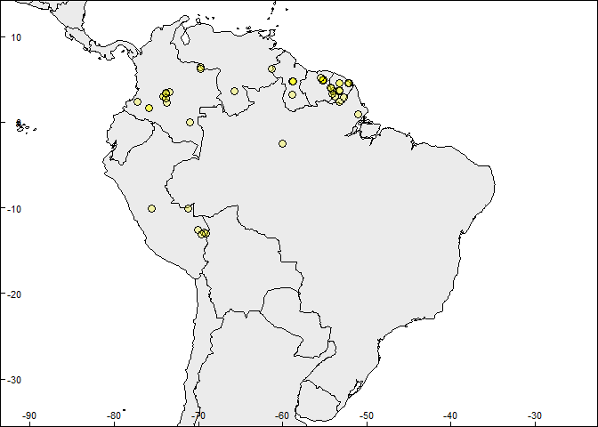<!-- -->

Same figure with country codes.

``` r
# simple figure of the species occurrence data
rangemap_explore(occurrences = occ_d, show_countries = TRUE)
```

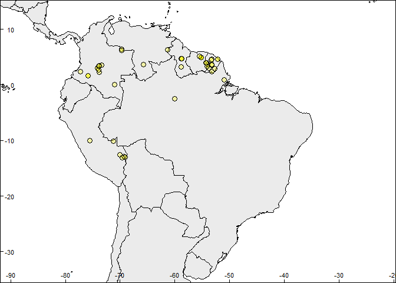<!-- -->

<br>

<hr>

### Species ranges from buffered occurrences

The *rangemap\_buff* function generates a distributional range for a
given species by buffering provided occurrences using a user-defined
distance.

The function’s help can be consulted using the following line of code:

``` r
help(rangemap_buffer)
```

An example of the use of this function is written below.

``` r
# getting the data 
data("occ_p", package = "rangemap")

# species range
buff_range <- rangemap_buffer(occurrences = occ_p, buffer_distance = 100000)

summary(buff_range)
#> 
#>                       Summary of sp_range_iucn object
#> ---------------------------------------------------------------------------
#> 
#> Species range derived from:  Buffer 
#> 
#>             Species Unique_records Range_area Extent_of_occurrence
#>  Peltophryne empusa             27   106241.2             66357.71
#>  Area_of_occupancy
#>                 92
#> 
#> 
#> 
#> Other contents
#>                        Length Class                    Mode
#> species_range           1     SpatialPolygonsDataFrame S4  
#> species_unique_records 27     SpatialPointsDataFrame   S4  
#> extent_of_occurrence    1     SpatialPolygonsDataFrame S4  
#> area_of_occupancy      23     SpatialPolygonsDataFrame S4
```

The function *rangemap\_plot* generates customizable figures of species
range maps using the objects produced by other function of this package.
Let’s see how the generated range looks like.

``` r
# creating the species range figure
rangemap_plot(buff_range)
```

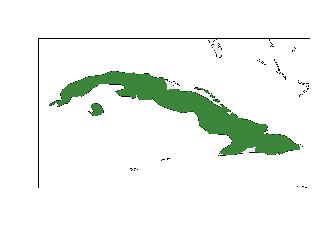<!-- -->

For further details see the function help.

``` r
help(rangemap_fig)
```

<br>

<hr>

### Species ranges from boundaries

The *rangemap\_boundaries* function generates a distributional range for
a given species by considering all the polygons of administrative
entities in which the species has been detected.

The function’s help can be consulted using the following line of code:

``` r
help(rangemap_boundaries)
```

Examples of the use of this function with most of its variants are
written below.

<br>

#### Using only occurrences

Following there is an example in which administrative areas will be
selected using only occurrences. The *rangemap\_explore* function will
be used for obtaining a first visualization of the species
distributional range.

``` r
# occurrence data was obtained in the first example using
# data("occ_d", package = "rangemap")

# checking which countries may be involved in the analysis
rangemap_explore(occurrences = occ_d, show_countries = TRUE)
```

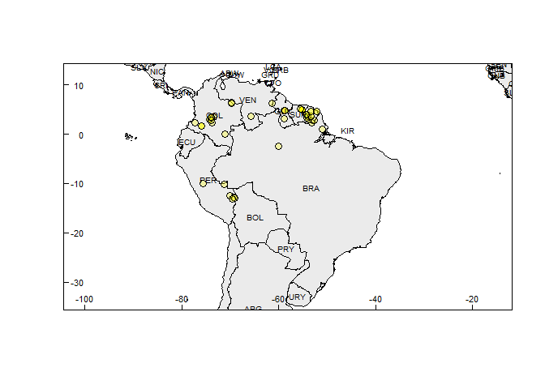<!-- -->

``` r

# getting an example of SpatialPolygonsDataFrame to be used as polygons
data("adm_boundaries", package = "rangemap")

# species range
bound_range <- rangemap_boundaries(occurrences = occ_d, polygons = adm_boundaries)

summary(bound_range)
#> 
#>                       Summary of sp_range_iucn object
#> ---------------------------------------------------------------------------
#> 
#> Species range derived from:  Boundaries 
#> 
#>           Species Unique_records Range_area Extent_of_occurrence
#>  Dasypus kappleri             55   12217732              4060381
#>  Area_of_occupancy
#>                176
#> 
#> 
#> 
#> Other contents
#>                        Length Class                    Mode
#> species_range           7     SpatialPolygonsDataFrame S4  
#> species_unique_records 55     SpatialPointsDataFrame   S4  
#> extent_of_occurrence    9     SpatialPolygonsDataFrame S4  
#> area_of_occupancy      44     SpatialPolygonsDataFrame S4
```

Figure of the generated range.

``` r
# creating the species range figure
rangemap_plot(bound_range)
```

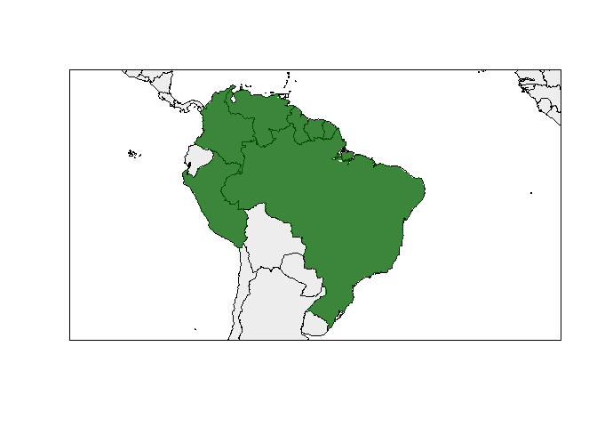<!-- -->

<br>

#### Using only administrative area names

Following there is an example in which administrative areas will be
selected using only the names of the administrative entities known to be
occupied by the species. This approach may be useful in circumstances
where geographic coordinates or accurate locality descriptions do not
exist.

``` r
# administrative areas invloved
adm <- c("Ecuador", "Peru", "Venezuela", "Colombia", "Brazil") 

# species range
bound_range1 <- rangemap_boundaries(adm_areas = adm, polygons = adm_boundaries)

summary(bound_range1)
#> 
#>                          Summary of sp_range object
#> ---------------------------------------------------------------------------
#> 
#> Species range derived from:  Boundaries 
#> 
#>  Species Range_area
#>  Species   12043257
#> 
#> 
#> 
#> Species range
#> Object of class SpatialPolygonsDataFrame
#> Coordinates:
#>         min       max
#> x -91.66389 -29.84000
#> y -33.74067  13.37861
#> Is projected: FALSE 
#> proj4string :
#> [+init=epsg:4326 +proj=longlat +datum=WGS84 +no_defs +ellps=WGS84
#> +towgs84=0,0,0]
#> Data attributes:
#>    X.Species.    rangekm2      
#>  Species:5    Min.   : 255493  
#>               1st Qu.: 909405  
#>               Median :1135524  
#>               Mean   :2408651  
#>               3rd Qu.:1294369  
#>               Max.   :8448466
```

Map of the generated range.

``` r
# creating the species range figure
rangemap_plot(bound_range1)
```

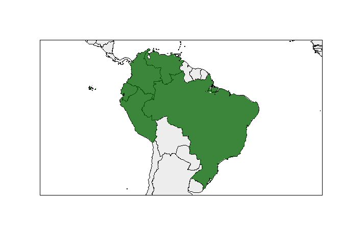<!-- -->

<br>

#### Using occurrences and administrative areas

An example of using both occurrences and administrative areas for
creating species ranges with the function *rangemap\_boundaries* is
presented below. This option may be useful when these two types of
information complement the knowledge of the species distribution.

``` r
# other parameters
adm <- "Ecuador" # Athough no record is on this country, we know it is in Ecuador

# species range
bound_range2 <- rangemap_boundaries(occurrences = occ_d, adm_areas = adm, 
                                    polygons = adm_boundaries)

summary(bound_range2)
#> 
#>                       Summary of sp_range_iucn object
#> ---------------------------------------------------------------------------
#> 
#> Species range derived from:  Boundaries 
#> 
#>           Species Unique_records Range_area Extent_of_occurrence
#>  Dasypus kappleri             55   12473215              4060381
#>  Area_of_occupancy
#>                176
#> 
#> 
#> 
#> Other contents
#>                        Length Class                    Mode
#> species_range           8     SpatialPolygonsDataFrame S4  
#> species_unique_records 55     SpatialPointsDataFrame   S4  
#> extent_of_occurrence    9     SpatialPolygonsDataFrame S4  
#> area_of_occupancy      44     SpatialPolygonsDataFrame S4
```

Map of the species range.

``` r
# creating the species range figure
rangemap_plot(bound_range2)
```

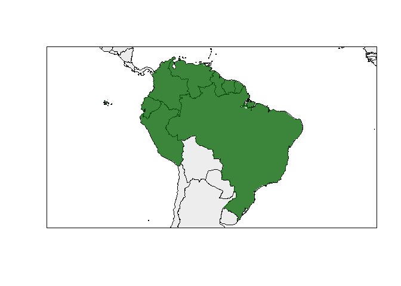<!-- -->

<br>

<hr>

### Species ranges from hull polygons

The *rangemap\_hull* function generates a species range polygon by
creating convex or concave hull polygons based on occurrence data.

The function’s help can be consulted using the following line of code:

``` r
help(rangemap_hull)
```

Examples of the use of this function with most of its variants are
written below.

<br>

#### Convex hulls

With the example provided below, a species range will be constructed
using convex hulls. After that this range will be split based on two
distinct algorithms of clustering: hierarchical and k-means. Convex hull
polygons are commonly used to represent species ranges, however in
circumstances where biogeographic barriers for the species dispersal
exist, concave hulls may be a better option.

``` r
# occurrences were obtained in prvious examples using
# data("occ_d", package = "rangemap")

# species range
hull_range <- rangemap_hull(occurrences = occ_d, hull_type = "convex", 
                            buffer_distance = 100000)
#> Hull type: convex

summary(hull_range)
#> 
#>                       Summary of sp_range_iucn object
#> ---------------------------------------------------------------------------
#> 
#> Species range derived from:  Convex_hull 
#> 
#>           Species Unique_records Range_area Extent_of_occurrence
#>  Dasypus kappleri             56    4860934              4063262
#>  Area_of_occupancy
#>                184
#> 
#> 
#> 
#> Other contents
#>                        Length Class                    Mode
#> species_range           6     SpatialPolygonsDataFrame S4  
#> species_unique_records 56     SpatialPointsDataFrame   S4  
#> extent_of_occurrence    1     SpatialPolygonsDataFrame S4  
#> area_of_occupancy      46     SpatialPolygonsDataFrame S4


# disjunct distributions
# clustering occurrences with the hierarchical method

# species range
hull_range1 <- rangemap_hull(occurrences = occ_d, hull_type = "convex", 
                             buffer_distance = 100000, split = TRUE, 
                             cluster_method = "hierarchical", 
                             split_distance = 1500000)
#> Clustering method: hierarchical
#> Hull type: convex

summary(hull_range1)
#> 
#>                       Summary of sp_range_iucn object
#> ---------------------------------------------------------------------------
#> 
#> Species range derived from:  Convex_hull_split 
#> 
#>           Species Unique_records Range_area Extent_of_occurrence
#>  Dasypus kappleri             56    2115826              4063262
#>  Area_of_occupancy
#>                184
#> 
#> 
#> 
#> Other contents
#>                        Length Class                    Mode
#> species_range           7     SpatialPolygonsDataFrame S4  
#> species_unique_records 56     SpatialPointsDataFrame   S4  
#> extent_of_occurrence    1     SpatialPolygonsDataFrame S4  
#> area_of_occupancy      46     SpatialPolygonsDataFrame S4


# clustering occurrences with the k-means method

# species range
hull_range2 <- rangemap_hull(occurrences = occ_d, hull_type = "convex", 
                             buffer_distance = 100000, split = TRUE, 
                             cluster_method = "k-means", n_k_means = 3)
#> Clustering method: k-means
#> Hull type: convex

summary(hull_range2)
#> 
#>                       Summary of sp_range_iucn object
#> ---------------------------------------------------------------------------
#> 
#> Species range derived from:  Convex_hull_split 
#> 
#>           Species Unique_records Range_area Extent_of_occurrence
#>  Dasypus kappleri             56    2115826              4063262
#>  Area_of_occupancy
#>                184
#> 
#> 
#> 
#> Other contents
#>                        Length Class                    Mode
#> species_range           7     SpatialPolygonsDataFrame S4  
#> species_unique_records 56     SpatialPointsDataFrame   S4  
#> extent_of_occurrence    1     SpatialPolygonsDataFrame S4  
#> area_of_occupancy      46     SpatialPolygonsDataFrame S4
```

Now the figure of the species range.

``` r
# creating the species range figure
rangemap_plot(hull_range) # try hull_range1 and hull_range2 as well
```

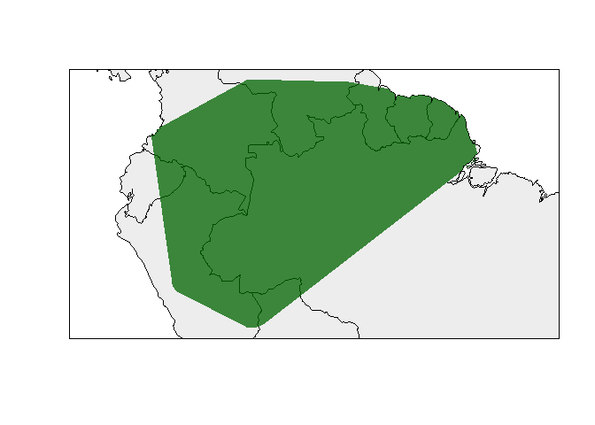<!-- -->

<br>

#### Concave hulls

With the following examples, the species range will be constructed using
concave hulls. The species range will be calculated as an only area and
as disjunct areas by clustering its occurrences using the k-means and
hierarchical methods.

``` r
# occurrences were obtained in prvious examples using
# data("occ_d", package = "rangemap")

# species range
hull_range3 <- rangemap_hull(occurrences = occ_d, hull_type = "concave", 
                             buffer_distance = 100000)
#> Hull type: concave
#> Warning in RGEOSBinTopoFunc(spgeom1, spgeom2, byid, id, drop_lower_td,
#> unaryUnion_if_byid_false, : spgeom1 and spgeom2 have different proj4 strings

summary(hull_range3)
#> 
#>                       Summary of sp_range_iucn object
#> ---------------------------------------------------------------------------
#> 
#> Species range derived from:  Concave_hull 
#> 
#>           Species Unique_records Range_area Extent_of_occurrence
#>  Dasypus kappleri             56    4327930              4063262
#>  Area_of_occupancy
#>                184
#> 
#> 
#> 
#> Other contents
#>                        Length Class                    Mode
#> species_range           4     SpatialPolygonsDataFrame S4  
#> species_unique_records 56     SpatialPointsDataFrame   S4  
#> extent_of_occurrence    1     SpatialPolygonsDataFrame S4  
#> area_of_occupancy      46     SpatialPolygonsDataFrame S4


# disjunct distributions
# clustering occurrences with the hierarchical method

# species range
hull_range4 <- rangemap_hull(occurrences = occ_d, hull_type = "concave", 
                             buffer_distance = 100000, split = TRUE, 
                             cluster_method = "hierarchical", 
                             split_distance = 1500000)
#> Clustering method: hierarchical
#> Hull type: concave
#> Warning in RGEOSBinTopoFunc(spgeom1, spgeom2, byid, id, drop_lower_td,
#> unaryUnion_if_byid_false, : spgeom1 and spgeom2 have different proj4 strings

summary(hull_range4)
#> 
#>                       Summary of sp_range_iucn object
#> ---------------------------------------------------------------------------
#> 
#> Species range derived from:  Concave_hull_split 
#> 
#>           Species Unique_records Range_area Extent_of_occurrence
#>  Dasypus kappleri             56    1878355              4063262
#>  Area_of_occupancy
#>                184
#> 
#> 
#> 
#> Other contents
#>                        Length Class                    Mode
#> species_range           6     SpatialPolygonsDataFrame S4  
#> species_unique_records 56     SpatialPointsDataFrame   S4  
#> extent_of_occurrence    1     SpatialPolygonsDataFrame S4  
#> area_of_occupancy      46     SpatialPolygonsDataFrame S4


# clustering occurrences with the k-means method

# species range
hull_range5 <- rangemap_hull(occurrences = occ_d, hull_type = "concave", 
                             buffer_distance = 100000, split = TRUE, 
                             cluster_method = "k-means", n_k_means = 3)
#> Clustering method: k-means
#> Hull type: concave
#> Warning in RGEOSBinTopoFunc(spgeom1, spgeom2, byid, id, drop_lower_td,
#> unaryUnion_if_byid_false, : spgeom1 and spgeom2 have different proj4 strings

summary(hull_range5)
#> 
#>                       Summary of sp_range_iucn object
#> ---------------------------------------------------------------------------
#> 
#> Species range derived from:  Concave_hull_split 
#> 
#>           Species Unique_records Range_area Extent_of_occurrence
#>  Dasypus kappleri             56    1878355              4063262
#>  Area_of_occupancy
#>                184
#> 
#> 
#> 
#> Other contents
#>                        Length Class                    Mode
#> species_range           6     SpatialPolygonsDataFrame S4  
#> species_unique_records 56     SpatialPointsDataFrame   S4  
#> extent_of_occurrence    1     SpatialPolygonsDataFrame S4  
#> area_of_occupancy      46     SpatialPolygonsDataFrame S4
```

Checking the figure.

``` r
# creating the species range figure
rangemap_plot(hull_range5) # try hull_range4 and hull_range5 as well
```

<!-- -->

<br>

<hr>

### Species ranges from ecological niche models results

The *rangemap\_enm* function generates a distributional range for a
given species using a continuous raster layer produced with an
ecological niche modeling algorithm. This function binarizes the model
into suitable and unsuitable areas using a user specified level of
omission (a given threshold value).

The function’s help can be consulted using the following line of code:

``` r
help(rangemap_enm)
```

An example of the use of this function is written below.

``` r
# parameters
sp_mod <- raster::raster(list.files(system.file("extdata", package = "rangemap"),
                                    pattern = "sp_model.tif", full.names = TRUE))
data("occ_train", package = "rangemap")

# species range
enm_range <- rangemap_enm(occurrences = occ_train, model = sp_mod, 
                          threshold_omission = 5)

summary(enm_range)
#> 
#>                       Summary of sp_range_iucn object
#> ---------------------------------------------------------------------------
#> 
#> Species range derived from:  ENM 
#> 
#>               Species Unique_records Range_area Extent_of_occurrence
#>  Amblyomma_americanum             89    2824883              3517287
#>  Area_of_occupancy
#>                356
#> 
#> 
#> 
#> Other contents
#>                        Length Class                    Mode
#> species_range          11     SpatialPolygonsDataFrame S4  
#> species_unique_records 89     SpatialPointsDataFrame   S4  
#> extent_of_occurrence    1     SpatialPolygonsDataFrame S4  
#> area_of_occupancy      89     SpatialPolygonsDataFrame S4
```

Let’s see how this range looks like.

``` r
# creating the species range figure
rangemap_plot(enm_range)
```

<!-- -->

<br>

<hr>

### Species ranges using trend surface analyses

The *rangemap\_tsa* function generates species range polygons for a
given species using a trend surface analysis. Trend surface analysis is
a method based on low-order polynomials of spatial coordinates for
estimating a regular grid of points from scattered observations. This
method assumes that all cells not occupied by occurrences are absences;
hence its use depends on the quality of data and the certainty of having
or not a complete sampling of the region of interest.

The function’s help can be consulted using the following line of code:

``` r
help(rangemap_tsa)
```

An example of the use of this function is written below.

``` r
# data
data("occ_f", package = "rangemap")
CU <- simple_wmap("simple", regions = "Cuba")

# species range
tsa_r <- rangemap_tsa(occurrences = occ_f, region_of_interest = CU)

summary(tsa_r)
#> 
#>                       Summary of sp_range_iucn object
#> ---------------------------------------------------------------------------
#> 
#> Species range derived from:  TSA 
#> 
#>               Species Unique_records Range_area Extent_of_occurrence
#>  Peltophryne fustiger             18       6825             1630.968
#>  Area_of_occupancy
#>                 48
#> 
#> 
#> 
#> Other contents
#>                        Length Class                    Mode
#> species_range           1     SpatialPolygonsDataFrame S4  
#> species_unique_records 18     SpatialPointsDataFrame   S4  
#> extent_of_occurrence    1     SpatialPolygonsDataFrame S4  
#> area_of_occupancy      12     SpatialPolygonsDataFrame S4
```

Let’s take a look at the results.

``` r
# creating the species range figure with a polygon defined by the user
rangemap_plot(tsa_r, polygons = CU, zoom = 0.5)
```

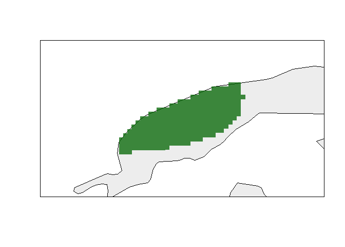<!-- -->

<br>

<hr>

### Nice figures of species ranges

The *rangemap\_plot* function can be used to plot not only the generated
species ranges but also the extent of occurrence and the species records
in the same map. The species range will be plot on a simplified world
map, but users can use a SpatialPolygons object of their choice.

The function’s help can be consulted using the following line of code:

``` r
help(rangemap_plot)
```

Examples of the use of this function are written below.

#### Including extent of occurrence

``` r
# creating the species range figure (hull_range5 was gnerated in a previous example)
rangemap_plot(hull_range5, add_EOO = TRUE)
```

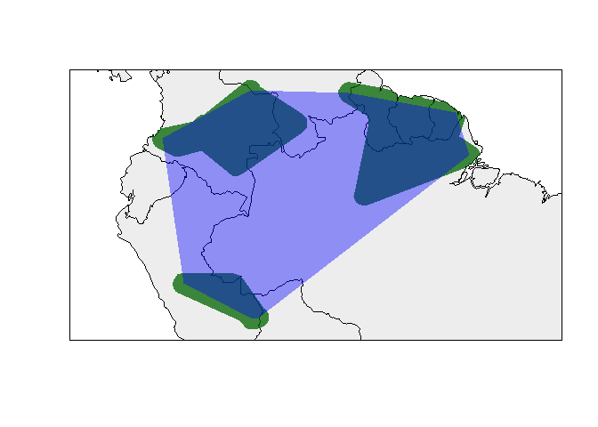<!-- -->

<br>

#### Including occurrences

``` r
# creating the species range figure (hull_range5 was gnerated in a previous example)
rangemap_plot(hull_range5, add_occurrences = TRUE)
```

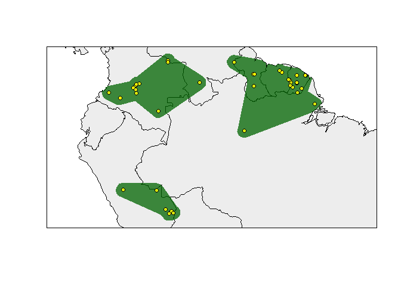<!-- -->

<br>

#### Including extent of occurrence and species records

``` r
# creating the species range figure (hull_range5 was gnerated in a previous example)
rangemap_plot(hull_range5, add_EOO = TRUE, add_occurrences = TRUE)
```

<!-- -->

<br>

#### Using other parameters

``` r
# creating the species range figure (hull_range5 was gnerated in a previous example)
rangemap_plot(hull_range5, add_EOO = TRUE, add_occurrences = TRUE,
              legend = TRUE, scalebar = TRUE, scalebar_length = 500, 
              zoom = 0.5, northarrow = TRUE)
```

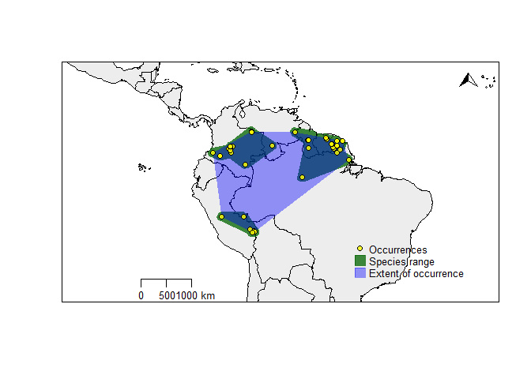<!-- -->

<br>

<hr>

### Species ranges and environmental factors

#### Species ranges on environmental factor maps

The *ranges\_emaps* function represents one or more ranges of the same
species on various maps of environmental factors (e.g. climatic
variables) to detect implications of using one or other type of range
regarding the environmental conditions in the area. Figures can be saved
using some of the function arguments.

The function’s help can be consulted using the following line of code:

``` r
help(ranges_emaps)
```

An example of the use of this function is written below.

``` r
# example data
data("buffer_range", package = "rangemap")
data("cxhull_range", package = "rangemap")
data("cvehull_range", package = "rangemap")

vars <- raster::stack(system.file("extdata", "variables.tif",
                                  package = "rangemap"))
names(vars) <- c("bio5", "bio6", "bio13", "bio14")

# plotting
ranges_emaps(buffer_range, cxhull_range, cvehull_range, variables = vars)
```

<!-- -->

<br>

#### Species ranges in the environmental space

The *ranges\_espace* function generates a three dimensional comparison
of a species’ ranges created using distinct algorithms, to visualize
implications of selecting one of them if environmental conditions are
considered.

The function’s help can be consulted using the following line of code:

``` r
help(ranges_espace)
```

An example of the use of this function is written below.

``` r
# example data
data("buffer_range", package = "rangemap")
data("cxhull_range", package = "rangemap")

vars <- raster::stack(system.file("extdata", "variables.tif",
                                  package = "rangemap"))
names(vars) <- c("bio5", "bio6", "bio13", "bio14")

## comparison
ranges_espace(buffer_range, cxhull_range, variables = vars,
              add_occurrences = TRUE)

# you can zoom in and rotate the figure for understanding it better
```

Saving this figures for publication can be done using functions from the
package `rgl` (e.g., `rgl.postscript()` and `rgl.snapshot()`) .
