rangemap vignette
================
Marlon E. Cobos, Vijay Barve, Narayani Barve, and Alberto Jiménez-Valverde
2018-08-04

-   [Package description](#package-description)
-   [Installing the package](#installing-the-package)
-   [Using the package functions](#using-the-package-functions)
    -   [Setting R up](#setting-r-up)
    -   [Simple graphical exploration of your data.](#simple-graphical-exploration-of-your-data.)
    -   [Species ranges from buffered occurrences](#species-ranges-from-buffered-occurrences)
    -   [Species ranges from boundaries](#species-ranges-from-boundaries)
        -   [Using only occurrences](#using-only-occurrences)
        -   [Using only administrative area names](#using-only-administrative-area-names)
        -   [Using occurrences and administrative areas](#using-occurrences-and-administrative-areas)
    -   [Species ranges from hull polygons](#species-ranges-from-hull-polygons)
        -   [Convex hulls](#convex-hulls)
        -   [Concave hulls](#concave-hulls)
    -   [Species ranges from ecological niche models](#species-ranges-from-ecological-niche-models)
    -   [Species ranges using trend surface analyses](#species-ranges-using-trend-surface-analyses)
    -   [Nice figures of species ranges](#nice-figures-of-species-ranges)
        -   [Including extent of occurrence](#including-extent-of-occurrence)
        -   [Including occurrences](#including-occurrences)
        -   [Including extent of occurrence and species records](#including-extent-of-occurrence-and-species-records)
        -   [Using other parameters](#using-other-parameters)
        -   [Saving the figure](#saving-the-figure)
    -   [Species ranges and environmental factors](#species-ranges-and-environmental-factors)
        -   [Species ranges on environmental factor maps](#species-ranges-on-environmental-factor-maps)
        -   [Species ranges in the environmental space](#species-ranges-in-the-environmental-space)

<br>

### Package description

The **rangemap** R package presents various tools to create species range maps based on occurrence data, statistics, and distinct shapefiles. Other tools of this package can be used to analyze environmental characteristics of the species ranges and to create high quality figures of these maps. All the functions that create species ranges also generate an approach to the species extent of occurrence (using convex hulls) and the area of occupancy according to the IUCN criteria are also generated. Shapefiles of the resultan polygons can be saved in the working directory if it is needed.

<br>

### Installing the package

**rangemap** is in a GitHub repository and can be installed and/or loaded using the following code (make sure to have Internet connection).

``` r
# Installing and loading packages
if(!require(devtools)){
    install.packages("devtools")
}

if(!require(rangemap)){
    devtools::install_github("marlonecobos/rangemap")
}
library(rangemap)
```

<br>

### Using the package functions

#### Setting R up

The following code chunk installs (if needed) and loads the R packages that will be used to get and prepare some data for performing the example analyses with the **rangemap** package.

``` r
# pacakges from CRAN
pcakages <- c("rgbif", "maps", "maptools", "raster")
req_packages <- pcakages[!(pcakages %in% installed.packages()[, "Package"])]
if (length(req_packages) > 0) {
  install.packages(req_packages, dependencies = TRUE)
}
sapply(pcakages, require, character.only = TRUE)

# package from github
if(!require(kuenm)){
devtools::install_github("marlonecobos/kuenm")
}
library(kuenm)
```

The working directory will also be defined in this part.

``` r
# working directory
setwd("YOUR/WORKING/DIRECTORY") # YOUR/WORKING/DIRECTORY
```

<br>

#### Simple graphical exploration of your data.

The *rangemap\_explore* function generates simple figures to visualize species occurrence data in the geographic space before using other functions of this package. The figure created with this function helps to identify countries involved in the species distribution. Other aspects of the species distribution can also be generally checked here; for instace, disjunt distributions, general dimension of the species range, etc.

The function's help can be consulted usign the following line of code:

``` r
help(rangemap_explore)
```

An example of the use of this function is written below.

``` r
# getting the data from GBIF
species <- name_lookup(query = "Dasypus kappleri",
                       rank="species", return = "data") # information about the species

occ_count(taxonKey = species$key[14], georeferenced = TRUE) # testing if keys return records
```

    ## [1] 44

``` r
key <- species$key[14] # using species key that return information

occ <- occ_search(taxonKey = key, return = "data") # using the taxon key

# keeping only georeferenced records
occ_d <- occ[!is.na(occ$decimalLatitude) & !is.na(occ$decimalLongitude),
             c("name", "decimalLongitude", "decimalLatitude")]
```

A simple figure.

``` r
# simple figure of the species occurrence data
rangemap_explore(occurrences = occ_d)
```

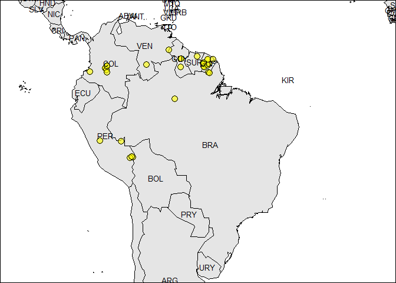

``` r
#dev.off() # for returning to default par settings
```

Same figure with country codes.

``` r
# simple figure of the species occurrence data
rangemap_explore(occurrences = occ_d, show_countries = TRUE)
```


``` r
#dev.off() # for returning to default par settings
```

<br>

#### Species ranges from buffered occurrences

The *rangemap\_buff* function generates a distributional range for a given species by buffering provided occurrences using a user-defined distance.

The function's help can be consulted usign the following line of code:

``` r
help(rangemap_buff)
```

An example of the use of this function is written below.

``` r
# getting the data from GBIF
species <- name_lookup(query = "Peltophryne empusa",
                       rank="species", return = "data") # information about the species

occ_count(taxonKey = species$key[1], georeferenced = TRUE) # testing if keys return records
```

    ## [1] 146

``` r
key <- species$key[1] # using species key that return information

occ <- occ_search(taxonKey = key, return = "data") # using the taxon key

# keeping only georeferenced records
occ_p <- occ[!is.na(occ$decimalLatitude) & !is.na(occ$decimalLongitude),
             c("name", "decimalLongitude", "decimalLatitude")]

# buffer distance
dist <- 100000
save <- FALSE # TRUE if you want to save the shapefiles in the working directory 
name <- "Test"

buff_range <- rangemap_buff(occurrences = occ_p, buffer_distance = dist,
                            save_shp = save, name = name)
```

The function *rangemap\_fig* generates customizable figures of species range maps using the objects produced by other function of this package. Let's see how the generated range looks like.

``` r
# creating the species range figure
rangemap_fig(buff_range, zoom = 1.2)
```

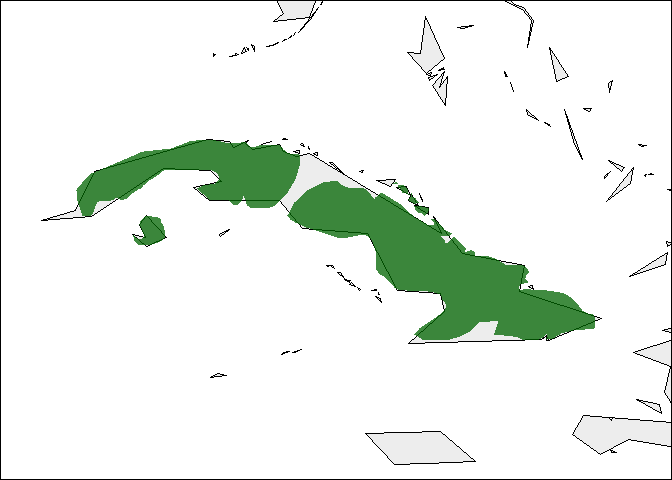

``` r
#dev.off() # for returning to default par settings
```

For further details see the function help.

``` r
help(rangemap_fig)
```

<br>

#### Species ranges from boundaries

The *rangemap\_bound* function generates a distributional range for a given species by considering all the polygons of administrative entities in which the species has been detected.

The function's help can be consulted usign the following line of code:

``` r
help(rangemap_bound)
```

Examples of the use of this function with most of its variants are written below.

<br>

##### Using only occurrences

Following there is an example in wich administrative areas will be selected using only occurrences. The *rangemap\_explore* function will be used for obtainig a first visualization of the species distributional range.

``` r
# data from GBIF for this species was downloaded in the first example

# checking which countries may be involved in the analysis
rangemap_explore(occurrences = occ_d, show_countries = TRUE)
```

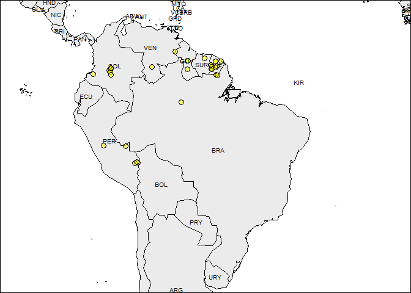

``` r
level <- 0
dissolve <- FALSE
save <- FALSE # TRUE if you want to save the shapefiles in the working directory 
name <- "test1"
countries <- c("PER", "BRA", "COL", "VEN", "ECU", "GUF", "GUY", "SUR", "BOL")

bound_range <- rangemap_bound(occurrences = occ_d, country_code = countries, boundary_level = level, 
                              dissolve = dissolve, save_shp = save, name = name)
```

Figure of the generated range.

``` r
# creating the species range figure
rangemap_fig(bound_range)
```


``` r
#dev.off() # for returning to default par settings
```

<br>

##### Using only administrative area names

Following there is an example in wich administrative areas will be selected using only the names of the administrative entities known to be occupied by the species. This approach may be useful in circumstances where goegraphic coordinates or aqurate localitie descriptions do not exist.

``` r
# administrative areas invloved
data("country_codes") #list of country names and ISO codes
head(country_codes)
```

    ##   Country_or_Area_Name ISO_ALPHA.2_Code ISO_ALPHA.3_Code
    ## 1          Afghanistan               AF              AFG
    ## 2        Aland Islands               AX              ALA
    ## 3              Albania               AL              ALB
    ## 4              Algeria               DZ              DZA
    ## 5       American Samoa               AS              ASM
    ## 6              Andorra               AD              AND
    ##   ISO_Numeric_Code_UN_M49_Numerical_Code
    ## 1                                      4
    ## 2                                    248
    ## 3                                      8
    ## 4                                     12
    ## 5                                     16
    ## 6                                     20

``` r
# View(country_codes) # if you want to see the complete list

level <- 0
adm <- c("Ecuador", "Peru", "Venezuela", "Colombia", "Brazil") # If we only know the countries in wich the species is
dissolve <- FALSE
save <- FALSE # TRUE if you want to save the shapefiles in the working directory 
name <- "test2"
countries <- c("PER", "BRA", "COL", "VEN", "ECU", "GUF", "GUY", "SUR", "BOL")

bound_range1 <- rangemap_bound(adm_areas = adm, country_code = countries, boundary_level = level,
                               dissolve = dissolve, save_shp = save, name = name)
```

Map of the generated range.

``` r
# creating the species range figure
rangemap_fig(bound_range1)
```

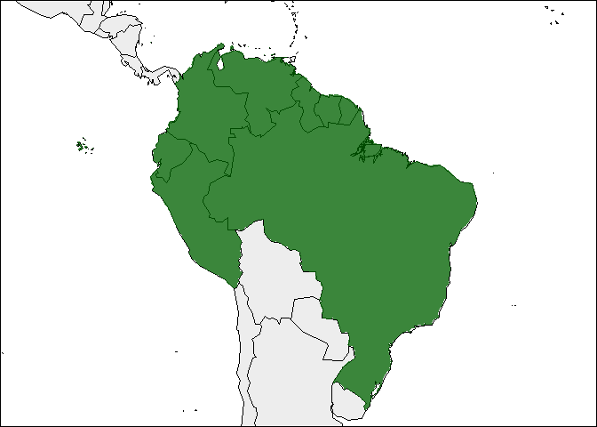

``` r
#dev.off() # for returning to default par settings
```

<br>

##### Using occurrences and administrative areas

An example of using both occurrences and administrative areas for creating species ranges with the function *rangemap\_bound* is presented below. This option may be useful when these two types of infromation complement the knowledge of the species distribution.

``` r
# occurrences from GBIF were downloaded in a previous step, see (occ_d)
# other parameters
level <- 0
adm <- "Ecuador" # Athough no record is on this country, we know it is in Ecuador
dissolve <- FALSE
save <- FALSE # TRUE if you want to save the shapefiles in the working directory 
name <- "test3"
countries <- c("PER", "BRA", "COL", "VEN", "ECU", "GUF", "GUY", "SUR", "BOL")

bound_range2 <- rangemap_bound(occurrences = occ_d, adm_areas = adm, country_code = countries,
                               boundary_level = level, dissolve = dissolve, save_shp = save, name = name)
```

Map of the species range.

``` r
# creating the species range figure
rangemap_fig(bound_range2)
```


``` r
#dev.off() # for returning to default par settings
```

<br>

#### Species ranges from hull polygons

The *rangemap\_hull* function generates a species range polygon by creating convex or concave hull polygons based on occurrence data.

The function's help can be consulted usign the following line of code:

``` r
help(rangemap_hull)
```

Examples of the use of this function with most of its variants are written below.

<br>

##### Convex hulls

With the example provided below, a species range will be constructed using convex hulls. After that this range will be split based on two distinct algorithms of clustering: hierarchical and k-means. Convex hull polygons are commonly used to represent species ranges, however in circunstances where biogeographic barriers for the species dispersal exist, concave hulls may be a better option.

``` r
# occurrences from GBIF were downloaded in a previous step, see (occ_d)
# unique polygon (non-disjunct distribution)
dist <- 100000
hull <- "convex" 
split <- FALSE
save <- FALSE # TRUE if you want to save the shapefiles in the working directory
name <- "test4"

hull_range <- rangemap_hull(occurrences = occ_d, hull_type = hull, buffer_distance = dist,
                            split = split, save_shp = save, name = name)
```

    ## 
    ## Hull type: convex

``` r
# disjunct distributions
## clustering occurrences with the hierarchical method
split <- TRUE
c_method <- "hierarchical"
split_d <- 1500000
name <- "test5"

hull_range1 <- rangemap_hull(occurrences = occ_d, hull_type = hull, buffer_distance = dist,
                             split = split, cluster_method = c_method, split_distance = split_d,
                             save_shp = save, name = name)
```

    ## 
    ## Clustering method: hierarchical
    ## 
    ## Hull type: convex

``` r
## clustering occurrences with the k-means method
c_method <- "k-means"
n_clus <- 3
name <- "test6"

hull_range2 <- rangemap_hull(occurrences = occ_d, hull_type = hull, buffer_distance = dist,
                             split = split, cluster_method = c_method, n_k_means = n_clus,
                             save_shp = save, name = name)
```

    ## 
    ## Clustering method: k-means
    ## 
    ## Hull type: convex

Now the figure of the species range.

``` r
# creating the species range figure
rangemap_fig(hull_range) # try hull_range1 and hull_range2
```

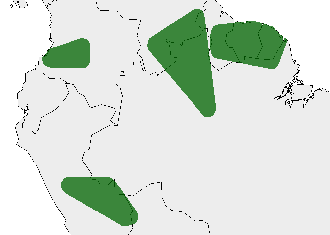

``` r
#dev.off() # for returning to default par settings
```

<br>

##### Concave hulls

With the following examples, the species range will be constructed using concave hulls. The species range will be calculated as an only area and as disjunt areas by clustering its occurrences using the k-means and hierarchical methods.

``` r
# occurrences from GBIF were downloaded in a previous step, see (occ_d)
# unique polygon (non-disjunct distribution)
dist <- 100000
hull <- "concave" 
split <- FALSE
save <- FALSE # TRUE if you want to save the shapefiles in the working directory
name <- "test7"

hull_range3 <- rangemap_hull(occurrences = occ_d, hull_type = hull, buffer_distance = dist,
                             split = split, save_shp = save, name = name)
```

    ## 
    ## Hull type: concave

``` r
# disjunct distributions
## clustering occurrences with the hierarchical method
split <- TRUE
c_method <- "hierarchical"
split_d <- 1500000
name <- "test8"

hull_range4 <- rangemap_hull(occurrences = occ_d, hull_type = hull, buffer_distance = dist,
                             split = split, cluster_method = c_method, split_distance = split_d,
                             save_shp = save, name = name)
```

    ## 
    ## Clustering method: hierarchical
    ## 
    ## Hull type: concave

``` r
## clustering occurrences with the k-means method
c_method <- "k-means"
n_clus <- 3
name <- "test9"

hull_range5 <- rangemap_hull(occurrences = occ_d, hull_type = hull, buffer_distance = dist,
                             split = split, cluster_method = c_method, n_k_means = n_clus,
                             save_shp = save, name = name)
```

    ## 
    ## Clustering method: k-means
    ## 
    ## Hull type: concave

Checking the figure.

``` r
# creating the species range figure
rangemap_fig(hull_range5) # try hull_range4 and hull_range5
```

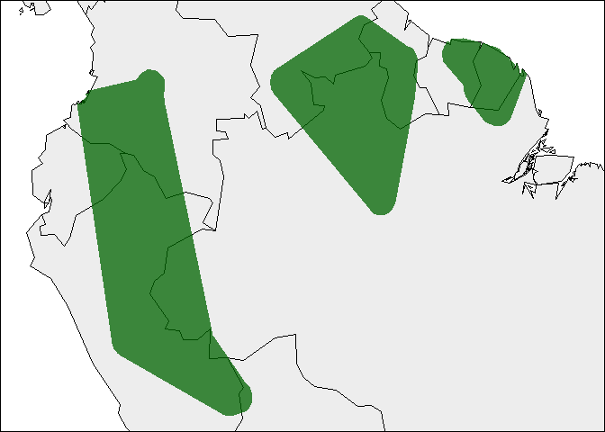

``` r
#dev.off() # for returning to default par settings
```

<br>

#### Species ranges from ecological niche models

The *rangemap\_enm* function generates a distributional range for a given species using a continuous raster layer produced with an ecological niche modeling algorithm. This function split the model in suitable and unsuitable areas using a user specified level of omission or a given threshold value.

The function's help can be consulted usign the following line of code:

``` r
help(rangemap_enm)
```

An example of the use of this function is written below.

``` r
# parameters
sp_mod <- raster::raster(list.files(system.file("extdata", package = "kuenm"),
                                    pattern = "sp_model.tif", full.names = TRUE))
sp_train <- read.csv(list.files(system.file("extdata", package = "kuenm"),
                                pattern = "sp_train.csv", full.names = TRUE))
occ_sp <- data.frame("A_americanum", sp_train)
thres <- 5
save <- FALSE # TRUE if you want to save the shapefiles in the working directory
name <- "test10"

enm_range <- rangemap_enm(occurrences = occ_sp, model = sp_mod, threshold_omission = thres,
                          save_shp = save, name = name)
```

Let's see how this range looks like.

``` r
# creating the species range figure
rangemap_fig(enm_range)
```

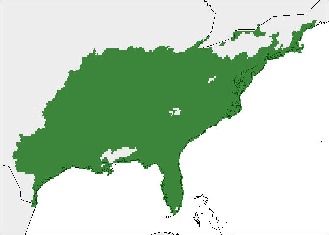

``` r
#dev.off() # for returning to default par settings
```

<br>

#### Species ranges using trend surface analyses

The *rangemap\_tsa* function generates species range polygons for a given species using a trend surface analysis. Trend surface analysis is a method based on low-order polynomials of spatial coordinates for estimating a regular grid of points from scattered observations. This method assumes that all cells not occupied by occurrences are absences; hence its use depends on the quality of data and the certainty of having or not a complete sampling of the regiong of interest.

The function's help can be consulted usign the following line of code:

``` r
help(rangemap_tsa)
```

An example of the use of this function is written below.

``` r
# getting the data from GBIF
species <- name_lookup(query = "Peltophryne fustiger",
                       rank="species", return = "data") # information about the species

occ_count(taxonKey = species$key[5], georeferenced = TRUE) # testing if keys return records
```

    ## [1] 53

``` r
key <- species$key[5] # using species key that return information

occ <- occ_search(taxonKey = key, return = "data") # using the taxon key

# keeping only georeferenced records
occ_f <- occ[!is.na(occ$decimalLatitude) & !is.na(occ$decimalLongitude),
             c("name", "decimalLongitude", "decimalLatitude")]

# region of interest
WGS84 <- CRS("+proj=longlat +datum=WGS84 +ellps=WGS84 +towgs84=0,0,0")
w_map <- map(database = "world", regions = "Cuba", fill = TRUE, plot = FALSE) # map of the world
w_po <- sapply(strsplit(w_map$names, ":"), function(x) x[1]) # preparing data to create polygon
reg <- map2SpatialPolygons(w_map, IDs = w_po, proj4string = WGS84) # map to polygon

# other data
res <- 1
thr <- 0
save <- FALSE # TRUE if you want to save the shapefiles in the working directory
name <- "test11"

tsa_r <- rangemap_tsa(occurrences = occ_f, region_of_interest = reg, threshold = thr,
                      resolution = res, save_shp = save, name = name)
```

Let's take a look at the results.

``` r
# creating the species range figure with a polygon defined by the user
rangemap_fig(tsa_r, polygons = reg, zoom = 3)
```

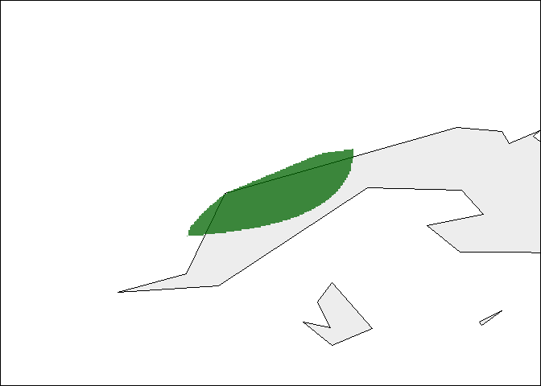

``` r
#dev.off() # for returning to default par settings
```

<br>

#### Nice figures of species ranges

The *rangemap\_fig* function can be used to plot not only the generated species ranges but also the extent of occurrence and the species records in the same map. The species range will be plot on a simplified world map, but users can use the SpatialPolygon objects of their choice.

The function's help can be consulted usign the following line of code:

``` r
help(rangemap_fig)
```

Examples of the use of this function are written below.

##### Including extent of occurrence

``` r
# arguments for the species range figure
extent <- TRUE

# creating the species range figure
rangemap_fig(hull_range5, add_extent = extent)
```

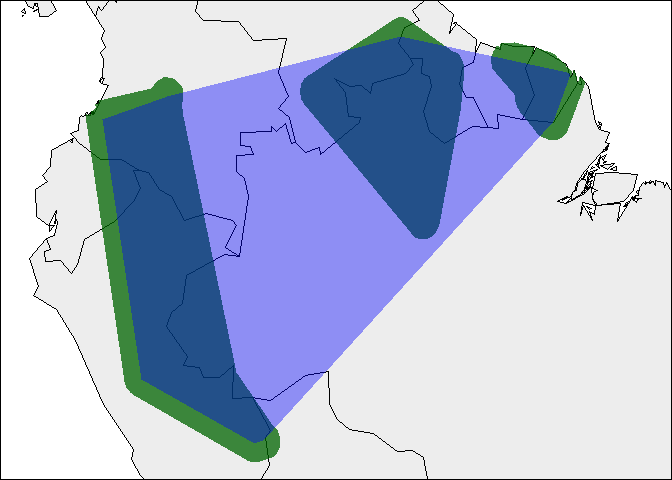

``` r
#dev.off() # for returning to default par settings
```

<br>

##### Including occurrences

``` r
# arguments for the species range figure
occ <- TRUE

# creating the species range figure
rangemap_fig(hull_range5, add_occurrences = occ)
```

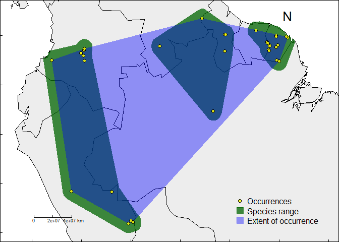

``` r
#dev.off() # for returning to default par settings
```

<br>

##### Including extent of occurrence and species records

``` r
# arguments for the species range figure
extent <- TRUE
occ <- TRUE

# creating the species range figure
rangemap_fig(hull_range5, add_extent = extent, add_occurrences = occ)
```


``` r
#dev.off() # for returning to default par settings
```

<br>

##### Using other parameters

``` r
# arguments for the species range figure
extent <- TRUE
occ <- TRUE
legend <- TRUE # leggend of objects included
scale <- TRUE # scale bar
north <- TRUE # north arrow
zoom1 <- 1.4 # normally 1


# creating the species range figure
rangemap_fig(hull_range5, add_extent = extent, add_occurrences = occ,
             legend = legend, scalebar = scale, scalebar_length = 500, 
             zoom = zoom1, northarrow = north)
```

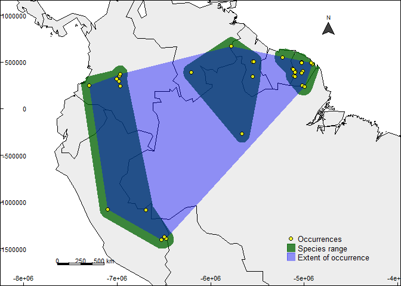

``` r
#dev.off() # for returning to default par settings
```

<br>

##### Saving the figure

``` r
# arguments for the species range figure
extent <- TRUE
occ <- TRUE
legend <- TRUE # leggend of objects included
scale <- TRUE # scale bar
north <- TRUE # north arrow
save <-  TRUE # FALSE by default

# creating the species range figure
range_map <- rangemap_fig(hull_range5, add_extent = extent, add_occurrences = occ,
                          legend = legend, scalebar = scale, scalebar_length = 500, 
                          northarrow = north, zoom = zoom1, save_fig = save)

#dev.off() # for returning to default par settings
```

<br>

#### Species ranges and environmental factors

##### Species ranges on environmental factor maps

The *ranges\_emaps* function represents one or more ranges of the same species on various maps of environmental factors (e.g. climatic variables) to detect implications of using one or other type of range regarding the environmental conditions in the area. Figures can be saved usign some of the function arguments.

The function's help can be consulted usign the following line of code:

``` r
help(ranges_emaps)
```

An example of the use of this function is written below.

``` r
# occurrences from GBIF were downloaded in a previous step, see (occ_d)
# range based on buffers
dist1 <- 500000

buff <- rangemap_buff(occurrences = occ_d, buffer_distance = dist1)


# range based on concave hulls
dist2 <- 250000
hullt <- "concave"

concave <- rangemap_hull(occurrences = occ_d, hull_type = hullt, buffer_distance = dist2)
```

    ## 
    ## Hull type: concave

``` r
# range based on convex disjunct hulls
split3 <- TRUE
hullt1 <- "convex"

convex <- rangemap_hull(occurrences = occ_d, hull_type = hullt1, buffer_distance = dist1,
                        split = split3, cluster_method = "k-means", n_k_means = 3)
```

    ## 
    ## Clustering method: k-means
    ## 
    ## Hull type: convex

``` r
# list of ranges
ranges <- list(buff, concave, convex)
names(ranges) <- c("buff", "concave", "convex_split")

# preparing environmental variables
## geting bioclimatic variables (some of them)
vars <- getData("worldclim", var = "bio", res = 5)[[c("bio1", "bio7", "bio12", "bio15")]]
## after the first view try with distinct or more variables

## mask variables to the region of interest
WGS84 <- CRS("+proj=longlat +datum=WGS84 +ellps=WGS84 +towgs84=0,0,0")
w_map <- map(database = "world", regions = c("Ecuador", "Peru", "Bolivia", "Colombia", "Venezuela",
                                             "Suriname", "Guyana", "French Guyana", "Brazil"),
             fill = TRUE, plot = FALSE) # map of the world

w_po <- sapply(strsplit(w_map$names, ":"), function(x) x[1]) # preparing data to create polygon
reg <- map2SpatialPolygons(w_map, IDs = w_po, proj4string = WGS84) # map to polygon

e <- extent(reg)
mask <- as(e, 'SpatialPolygons')

## variables to be used in the analysis
variables <- crop(vars, mask)

# ranges on evironmental factor maps
ranges_emaps(ranges = ranges, variables = variables)
```


``` r
#dev.off() # for returning to default par settings
```

<br>

##### Species ranges in the environmental space

The *ranges\_espace* function generates a three dimensional comparison of a species' ranges created using distinct algortihms, to visualize implications of selecting one of them if environmental conditions are considered.

The function's help can be consulted usign the following line of code:

``` r
help(ranges_espace)
```

An example of the use of this function is written below.

``` r
# list of ranges
ranges1 <- list(buff, concave) # this ranges were created in the previous exercise
names(ranges1) <- c("buff", "concave")

# bioclimatic variables for environmental comparisson
vars <- getData("worldclim", var = "bio", res = 5)

variables <- crop(vars, mask)

# comparison
occur <- TRUE
env_comp <- ranges_espace(ranges = ranges1, add_occurrences = occur, variables = variables)

# use the created object to see again the figure
env_comp

# you can zoom in and rotate the figure for understanding it better
```

Since saving this figures for publication may be challenging, following you will find lines of code that will allow you to do it.

``` r
op <- options() # save default options
options(viewer = NULL) # set viewer to web browser
name <- "ranges_space" # name for figure

# using web browser to save image
env_comp %>% htmlwidgets::onRender(
paste("function(el, x)
{var gd = document.getElementById(el.id);
Plotly.downloadImage(gd, {format: 'svg', width: ", 1000, ", height: ",
800, ", filename: ", paste("\'", name, "\'", sep = ""), "});
}", sep = "")
)

Sys.sleep(2) # waiting for the execution
options(viewer = op$viewer) # restore viewer to old setting (e.g. RStudio)
```
