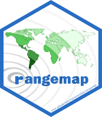
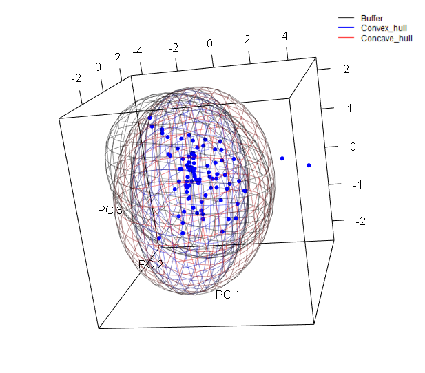

```{r setup, include=FALSE}
knitr::opts_chunk$set(collapse = TRUE, comment = "#>", echo = FALSE)
```

</a>

## Figures with rangemap

If you haven't seen the rangemap [short tutorial I](rangemap_short_tutorial_I.html), [short tutorial II](rangemap_short_tutorial_II.html), and [short tutorial III](rangemap_short_tutorial_III.html), take a look at them for more background on the **rangemap** R package. 

In this example we will explore three functions of this package that allow the users to create species range maps using the outputs of the functions *rangemap_boundaries*, *rangemap_buffer*, *rangemap_enm*, *rangemap_hull*, and *rangemap_tsa*.

### Species distribution ranges using three distinct algorithms

**Species range based on buffers**

The function *rangemap_buffer* generates a distributional range for a given species by buffering provided occurrences using a defined distance. See the function's help for more details.

```{r, eval=FALSE, echo=TRUE}
# Getting the data
data("occ_d", package = "rangemap")

# Defining parameters
dist <- 100000 # buffer distance in meters

# Now we can create the species range based on buffers
buff_range <- rangemap_buffer(occurrences = occ_d, buffer_distance = dist)
```

**Species range based on convex hulls**

With the *rangemap_hull* function we can generate a distributional range for a given species by buffering provided occurrences using a defined distance. See the function's help for more details.

```{r, eval=FALSE, echo=TRUE}
# Defining parameters
dist <- 100000
hull <- "convex"

# Now we can create the species range based on administrative areas
hull_range <- rangemap_hull(occurrences = occ_d, hull_type = hull, 
                            buffer_distance = dist)
```

**Species range based on concave hulls**

The function *rangemap_hull* generates a distributional range for a given species based on provided occurrences and two distinct type of hulls, convex and concave. See the function's help for more details.

```{r, eval=FALSE, echo=TRUE}
# Defining parameters
dist <- 200000
hull <- "concave"

# Now we can create the species range based on administrative areas
hull_range1 <- rangemap_hull(occurrences = occ_d, hull_type = hull, 
                             buffer_distance = dist)
```

**Now the figure of our results**

The other one with the potential extent of occurrence, the species occurrences and other map details. But let's first define the characteristics we want in the figure.

```{r, fig.show='hold', warning=FALSE, eval=FALSE, echo=TRUE}
par(mar = rep(0, 4)) # optional, reduces the margins of the figure
rangemap_plot(buff_range, add_occurrences = TRUE, 
             northarrow = TRUE, range_color = NA)
rangemap_plot(buff_range)
rangemap_plot(hull_range)
rangemap_plot(hull_range1, legend = TRUE, legend_position = "bottomleft")
```

```{r}
knitr::include_graphics(c("vignette_img/VIV_dc1.png", "vignette_img/VIV_dc2.png",
                          "vignette_img/VIV_dc3.png", "vignette_img/VIV_dc4.png"))
```

### Species distribution ranges on environmental maps

The function *ranges_emaps* represents one or more ranges of the same species on various maps of environmental factors (e.g., climatic variables) to detect implications of using one or other type of range regarding the environmental conditions in the areas.


```{r, eval=FALSE, echo=TRUE}
# Adding parameters
vars <- raster::stack(system.file("extdata", "variables.tif",
                                  package = "rangemap"))
names(vars) <- c("bio5", "bio6", "bio13", "bio14")

# Plotting
par(mar = rep(0, 4))
ranges_emaps(buff_range, hull_range, hull_range1, variables = vars)
```

```{r, fig.width=7, fig.height=7}
knitr::include_graphics("vignette_img/VIV_ranges_g.png")
```

### Species distribution ranges in environmental space

The function *ranges_espace* generates a three dimensional comparison of a species' ranges created using distinct algorithms, to visualize implications of selecting one of them if environmental conditions are considered.

```{r, eval=FALSE, echo=TRUE}
# For avoiding too much complexity we will use only two of the previous ranges
# comparison
ranges_espace(buff_range, hull_range, variables = vars, add_occurrences = TRUE)

```

```{r, fig.width=7, fig.height=7}
knitr::include_graphics("vignette_img/VIV_ranges_e1.png")
```

Now let's create the same figure but with the three ranges and distinct colors.

```{r, eval=FALSE, echo=TRUE}
ranges_espace(buff_range, hull_range, hull_range1, variables = vars, 
              range_colors = c("gray1", "blue", "red"), alpha = 0.4)
```

```{r, fig.width=7, fig.height=7}

```
